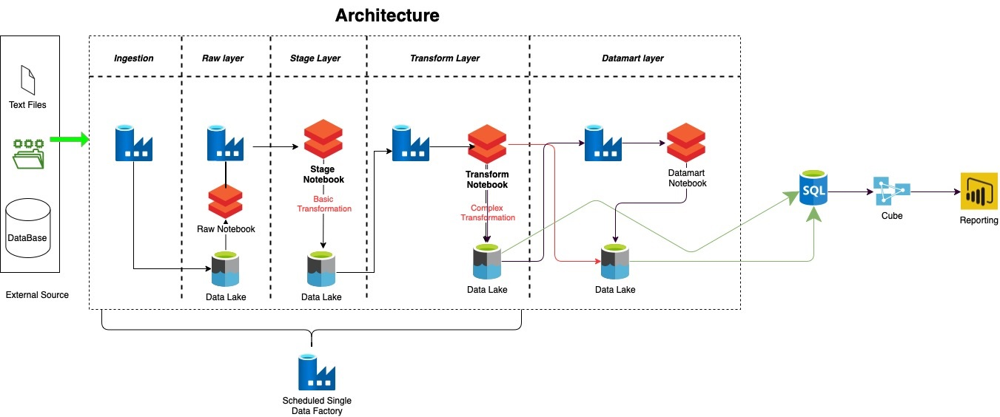

# Life cycle of Framework

1. What is Framework?
  * Frameworks are platforms used to develop applications. It provides software developers with a structure to build programs that run on a specific platform. 
  * In a framework, for instance, input can be processed, hardware devices can be managed, and system software can be interacted with.
  * In addition to libraries and compilers, a framework could also contain various other programs that are typically needed in software development.
  * This transformation deals with taking input from the users in JSON file with pre-defined key & values and then load the data into respective stages.  
3. Why do we need?
4. 

# Databricks_Framework

##### Basic Architecture diagram

______

Lets deep dive in the architecture :

ETL (Extract-Transform-Load) is the process of extracting, transforming, and loading data. Using Azure Data Factory pipelines in the Ingestion layer and Extract layer, we are extracting flat files from a variety of sources and adding them to a raw layer on Azure Data Lakes (ADLS). Once the data is available in the raw layer using ADF we are calling our databricks framework and perform some of the transformation on the raw data. Transformations are done on the basis of input provided to the framework.
